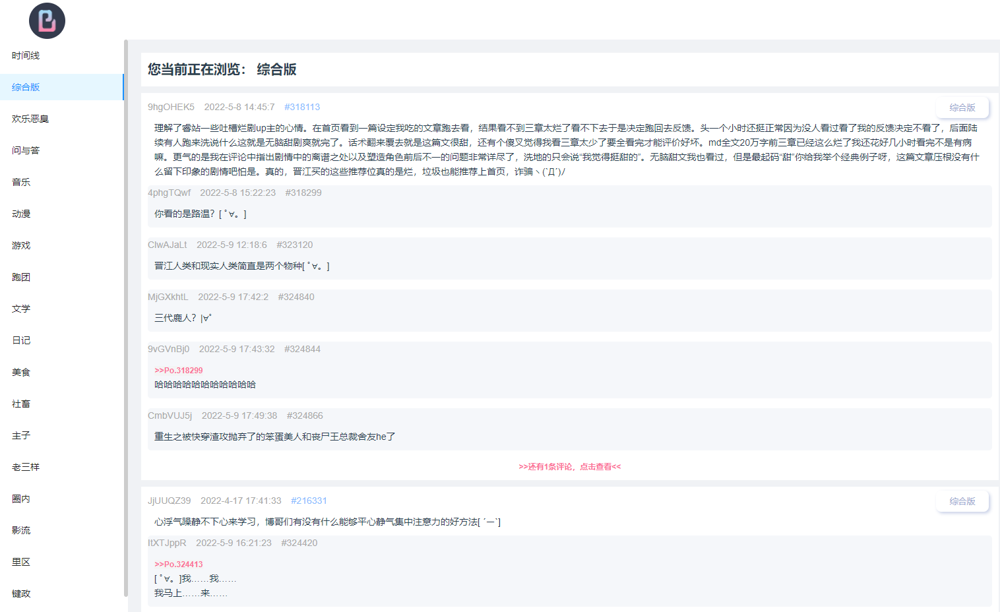

# B岛 匿名版demo

* [前言](#前言)
* [介绍B岛](#介绍B岛)
* [项目相关](#项目相关 )
* [相关截图](#相关截图)

## 前言
做这个项目纯粹因为隔离没事情做，想学点新的知识，如vuex vue3.0以及一些新的技术。

## 介绍B岛
[BOG匿名版（B岛）](http://bog.ac/)，无需注册即可发文的综合匿名社区。在这里，你可以畅所欲言。

## 项目相关
根据[网络上已有的接口](https://easydoc.net/s/74385062)自己封装了axios请求，
利用vuex来管理组件间数据状态，目前大部分组件还是自己写的，
基本没有用到package.json里边引入的element和antd组件框架，
有个搜索框封装了但是没有做回车监听，还没有使用起来。
左侧的菜单栏是antd的，按钮是前段时间看到新拟态设计，做了一系列的封装，
目前有CheckBox、switch、radio、button等组件，
不过放到这边有点违和不排除后续再改成antd。

## 相关截图

主页面

## 项目目标
- [x] 获取版块列表
- [x] 获取版块下的帖子列表
- [x] 获取帖子详情
- [x] 图片展示（略缩图）
- [X] 图片展示（大图）
- [ ] 分页功能(不太清楚怎么搞的最大值，没有相关接口，没有实现)
- [ ] 搜索功能
- [ ] 签到功能
- [ ] 点击引用打开相关评论
